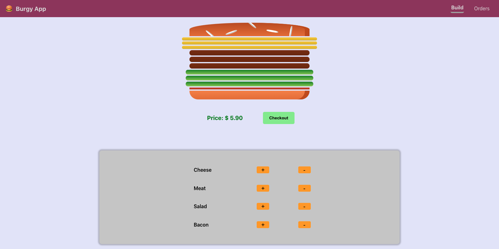

The website is deployed at: https://burgyapp.netlify.app/

Dynamically builds a burger based on the ingredients added by the user. Previous orders are stored in localStorage and is available in the 'Orders' page. Built with React and react-router-dom.

